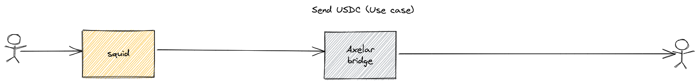
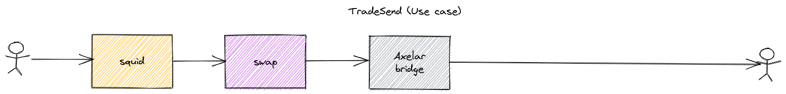
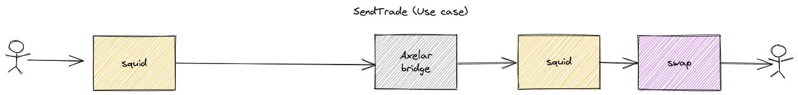
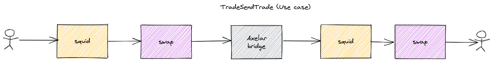

# Squidswap ABI Example Project

This projects demonstrates the interation into squidswap
using the contract ABI. This is ment to be a early access pre-view.
We are currently developing an API to simplifiy trade data generation
as well as an SDK which bundles required contract interactions.

## Setup steps

Copy the `.env.template` as `.env`

Replace private key and infura project ID
```bash
PRIVATE_KEY="insert private key here"
INFURA_PROJECT_ID=""
```

## Fund Test account

Faucets:
[Ethereum Rinkeby](https://faucet.egorfine.com/)
[Avalanche C-Net](https://faucet.avax.network/)
[Moonbase Alpha](https://apps.moonbeam.network/moonbase-alpha/faucet/)

## Running the examples

Default each scripts is executed against [Ropsten network](https://ropsten.etherscan.io/).
So make sure you have ETH and wrapped ETH in your wallet.

If you want to test other than networks as origin (default Ropsten) for a swap or send transaction.
The example code has to be updated to accomodate for the correct addresses and RPC server.

```javascript
const srcChain = "ethereum"; //define what is source user starting point
const destChain = "avalanche"; //define where the funds are send to

const destAUSDC = AUSDC[destChain]; //aUSDC address on destination chain
const srcAUSDC = AUSDC[srcChain]; //aUSDC address on source chain
// to from wrapped native asset on srcChain
const wrappedAvax = WRAPPED_NATIVE_ASSET[destChain]; //wrapped native assets on destination
const wrappedETH = WRAPPED_NATIVE_ASSET[srcChain]; //wrapped native assets source
```

Change RPC server for script by passing `--network {ropsten|fuji|moonbase}`

```shell
##yarn {send|tradesend|sendtrade|tradesendtrade} --network {ropsten|fuji|moonbase}
yarn send --network moonbase
```

### Send



Send native USDC/axlUSDC (wrapped USDC) token to the destination chain
requires aUSDC token in user wallet.

```shell
yarn send
```

### TradeSend



Swaps token and send axlUSDC (wrapped USDC) token to the destination chain

```shell
yarn tradesend
```

### SendTrade



Sends native axlUSDC (aUSDC on testnet) token and swaps axlUSDC to WAVAX on destination
chain.

```shell
yarn sendtrade
```

### TradeSendTrade



Swaps WETH to aUSDC and bridges assets to destination chain. On destination chains
assets will be swapped again from aUSDC to WAVAX.

```shell
yarn tradesendtrade
```